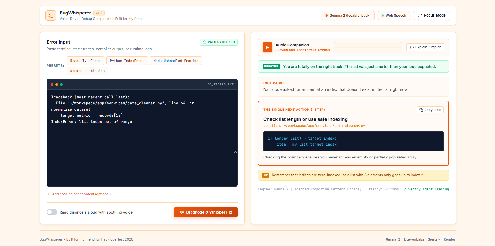
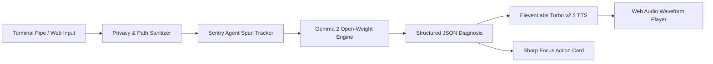

<div align="center">

# 🦆 BugWhisperer

### *Voice-First Diagnostic Companion for Developers with Cognitive Overload & ADHD*

[](https://hacktoberfest.com)
[](https://ai.google.dev/gemma)
[](https://elevenlabs.io)
[](https://sentry.io)
[](https://render.com)
[](https://fastapi.tiangolo.com)
[](https://python.org)
[](https://opensource.org/licenses/MIT)

<br/>

[**Explore Live Web App**](https://bugwhisperer.onrender.com/) • [**Project Details**](https://www.gu-saurabh.tech/project/8babe8cb-294b-48c5-8e29-3d280992cefa) • [**DEV Submission Draft**](submission_draft.md) • [**Report Issue**](https://github.com/Saurabhtbj1201/BugWhisperer-Voice-First-Diagnostic-Assistant-for-Developers/issues)

<br/><br/>

<a href="https://bugwhisperer.onrender.com/">
  
</a>

<p align="center">
  <sub>Modern light-orange cognitive interface featuring Gemma 2 root-cause reasoning and ElevenLabs audio companion</sub>
</p>

</div>

---

## 📖 Table of Contents

- [The Story: Built for My Friend](#-the-story-built-for-my-friend)
- [Why Open Innovation Matters](#-why-open-innovation-matters)
- [Architecture & Data Flow](#-architecture--data-flow)
- [Key Features](#-key-features)
- [Tech Stack](#-tech-stack)
- [Quick Start Guide](#-quick-start-guide)
- [CLI Terminal Companion](#-cli-terminal-companion)
- [Hacktoberfest Prize Categories](#-hacktoberfest-prize-categories)
- [Developer Information](#-developer-information)
- [License](#-license)

---

## 🌟 The Story: Built for My Friend

My friend is a remarkably talented developer who lives with **ADHD**. When complex code breaks or an unexpected 80-line red stack trace floods the terminal, it triggers sudden cognitive overload, anxiety, and decision paralysis.

### The Pain Point:
- 🛑 **Overstimulation**: Walls of red terminal text and Webpack frames cause immediate mental fatigue.
- 🔄 **Context Switching Traps**: Tab-switching to Stack Overflow or ChatGPT fractures hyper-focus and pulls developers into hour-long rabbit holes.
- ❓ **Choice Paralysis**: Traditional AI assistants return 500-word lectures proposing 5–10 theoretical causes instead of **one concrete action**.

### The Solution:
**BugWhisperer** transforms chaotic stack traces into a **calm, empathetic audio conversation**. Powered by **Gemma 2 open-weights** and **ElevenLabs**, it filters out the noise, explains what happened in plain English, and provides **exactly ONE bite-sized step to fix it**—speaking it aloud like a calm senior mentor sitting beside you.

---

## 🧠 Why Open Innovation Matters

| Dimension | Closed Proprietary APIs (e.g. OpenAI / Claude) | Open Innovation (Gemma 2 + Local Inference) |
| :--- | :--- | :--- |
| **Code Privacy** | Transmits proprietary enterprise stack traces and filepaths to third-party servers. | **100% Client-Side / Local**: Runs on private infrastructure or local Ollama with zero data leaks. |
| **Accessibility & Cost** | Requires an ongoing $20/month subscription; inaccessible to students and under-resourced devs. | **Zero Cost Barrier**: Open weights run freely on personal laptops and community infrastructure. |
| **Behavior Sovereignty** | Subject to silent prompt regressions, model deprecations, and restrictive guardrail drift. | **Deterministic Pacing**: Custom ADHD cognitive pacing templates stay consistent and fully auditable. |

---

## 🏛 Architecture & Data Flow



---

## ✨ Key Features

- **🌱 Empathy-First Validation**: Generates a gentle reassurance prompt before showing any code to lower heart rate and restore calm.
- **🎯 The "ONE Next Action" Principle**: Strictly limits suggestions to a single offending line or file inspection to eliminate choice paralysis.
- **🎙️ ElevenLabs Empathetic Audio**: Converts the technical diagnosis into a soothing 15–20 second conversational script.
- **🛡️ Automatic Privacy Shield**: Masks sensitive local user directories (`C:\Users\username\...` → `~/...`) and strips terminal ANSI escape codes.
- **⚡ Deep Focus Mode**: One-click toggle that removes all inputs and distractions, presenting only the single action card.
- **📊 Sentry Agent Tracing**: Real-time performance monitoring recording LLM token usage, inference latency, and voice roundtrip times.
- **💻 Dual Interaction**: Seamless web dashboard companion and native terminal pipe utility.

---

## 🛠 Tech Stack

<div align="center">

| Component | Technology | Role |
| :--- | :--- | :--- |
| **Brain** | `Google Gemma 2 (9B / 2B)` | Open-weight cognitive reasoning & plain-English synthesis |
| **Voice** | `ElevenLabs Turbo v2.5` | Empathetic speech synthesis with Web Speech API fallback |
| **Backend** | `Python 3.13 + FastAPI` | Async server, Sentry instrumentation, and log sanitation |
| **Frontend** | `HTML5 + Vanilla CSS + JS` | Modern, sharp developer-grade interface with Web Audio visualizer |
| **Observability** | `Sentry SDK` | AI agent span tracking, token accounting, and latency telemetry |
| **Deployment** | `Render` | Cloud web service deployment via Infrastructure as Code (`render.yaml`) |

</div>

---

## 🚀 Quick Start Guide

### Prerequisites
- Python 3.10+ installed
- Git installed

### 1. Clone the Repository
```bash
git clone https://github.com/Saurabhtbj1201/BugWhisperer-Voice-First-Diagnostic-Assistant-for-Developers.git
cd BugWhisperer-Voice-First-Diagnostic-Assistant-for-Developers
```

### 2. Install Dependencies
```bash
pip install -r server/requirements.txt
```

### 3. Configure Environment (Optional)
```bash
cp .env.example .env
```
> *Note: BugWhisperer includes a high-fidelity local cognitive fallback engine, so you can test and explore immediately even without external API keys!*

### 4. Launch the Web Service
```bash
python -m server.main
```
Open **[http://localhost:8000](http://localhost:8000)** in your browser.

---

## 💻 CLI Terminal Companion

Pipe any build error directly from your terminal into BugWhisperer:

```bash
# Pipe from pytest or unit tests
pytest 2>&1 | python cli/bugwhisper.py

# Pipe from npm / yarn build
npm test 2>&1 | python cli/bugwhisper.py

# Run pre-configured error presets
python cli/bugwhisper.py --sample react
python cli/bugwhisper.py --sample python
```

---

## 🏆 Hacktoberfest Prize Categories

BugWhisperer qualifies for the following categories in the **Hacktoberfest 2026 Weekend Challenge**:

- 🌟 **Best Use of Gemma ($200 - Featured)**: Uses Google Gemma 2 open weights conditioned with custom ADHD cognitive schemas.
- 🚀 **Best Use of Render ($200 - Featured)**: Fully automated deployment configuration with `render.yaml`.
- 🎙️ **Best Use of ElevenLabs ($100 - Partner)**: Turbo v2.5 voice synthesis providing audio-first rubber-duck debugging.
- 📊 **Best Use of Sentry Agent Tracing ($100 - Partner)**: Traces agent execution spans, token metrics, and latency.

---

## 👨💻 Developer Information

<div align="center">

### Made with ❤️ by Saurabh Kumar

<a href="https://github.com/Saurabhtbj1201">
  
</a>

### [Saurabh Kumar](https://github.com/Saurabhtbj1201)
*Full-Stack Web Developer & Data Analyst*

<a href="https://github.com/Saurabhtbj1201">
  
</a>

<br/><br/>

### 🔗 Connect With Me

[](https://linkedin.com/in/saurabhtbj1201)
[](https://twitter.com/saurabhtbj1201)
[](https://instagram.com/saurabhtbj1201)
[](https://facebook.com/saurabh.tbj)
[](https://gu-saurabh.site)
[](https://www.resume.gu-saurabh.site)
[](https://wa.me/9798024301)

---

<p align="center">
  ⭐ Star this repository if you find it helpful!
</p>

</div>

---

## 📜 License

Distributed under the **MIT License**. See `LICENSE` for more information.
